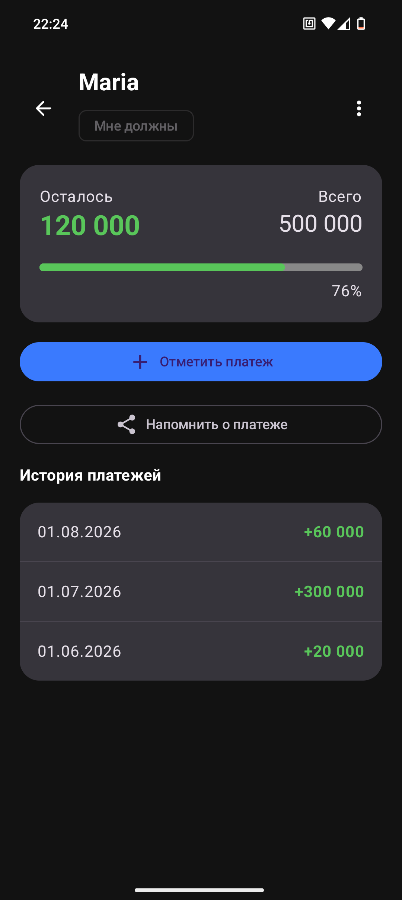
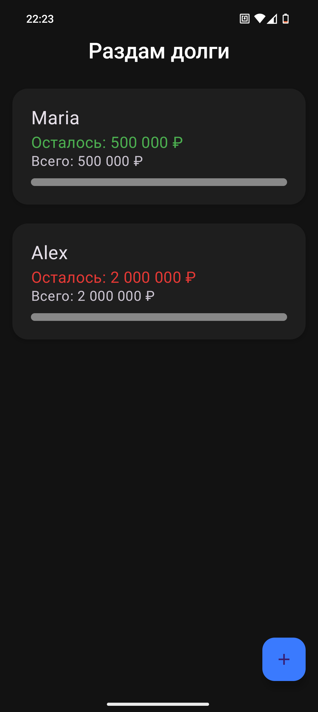

# DebtTracker — Personal Debt Tracker

An Android app for tracking personal debts. Record who you owe and who owes you, log partial payments, and stay on top of your debts with customizable reminders.

<p align="center">
  
  &nbsp;&nbsp;
  
</p>

---

## Features

- **Two debt types:** "I Owe" (`I_OWE`) and "Owe Me" (`OWE_ME`) with visual color coding (red/green).
- **Partial payment tracking:** record payments against each debt — the remaining balance recalculates automatically.
- **Payment history:** full list of all payments per debt with dates and amounts.
- **Edit debts:** change the name, amount, creation date, and reminder interval — remaining balance recalculates correctly accounting for payments already made.
- **Reminders:** configure an interval (in days) for recurring notifications about unpaid debts. Powered by `WorkManager`.
- **Full debt deletion:** removes the debt and all associated payments in a single atomic transaction.
- **Material 3:** modern UI built with Jetpack Compose, supporting dark theme.

---

## Tech Stack

| Category | Technology |
|---|---|
| Language | Kotlin |
| UI | Jetpack Compose + Material 3 |
| Architecture | MVVM |
| Database | Room (SQLite) |
| Reactivity | Kotlin Coroutines + Flow |
| Navigation | Jetpack Navigation Compose |
| Background tasks | WorkManager |
| Build system | Gradle (Kotlin DSL) |

---

## Architecture

The app follows the **MVVM** pattern with a clean layer separation:

```
┌─────────────────────────────────────┐
│  UI Layer (Compose Screens)         │
│  MainScreen, DebtDetailsScreen,     │
│  Dialogs (DebtDialog, EditDebt,     │
│  DebtTypeSelector)                  │
├─────────────────────────────────────┤
│  ViewModel Layer                    │
│  MainViewModel, DebtDetailsVM       │
│  → Manages UI state                │
│  → Calls Repository methods        │
├─────────────────────────────────────┤
│  Data Layer                         │
│  Repository                         │
│  → Business logic (transactions,    │
│    amount recalculation)            │
│  → DAO (DebtDao, PaymentDao)       │
│  → Entity (Debt, Payment, DebtType)│
├─────────────────────────────────────┤
│  Room Database (SQLite)             │
│  Tables: debts, payments            │
└─────────────────────────────────────┘
```

### Database Schema

#### `debts` table

| Column | Type | Description |
|---|---|---|
| `id` | INTEGER (PK, auto-increment) | Unique identifier |
| `name` | TEXT | Debt name/title |
| `type` | TEXT (`I_OWE` / `OWE_ME`) | Debt type |
| `initialAmount` | INTEGER | Original debt amount |
| `currentAmount` | INTEGER | Remaining unpaid amount |
| `createdAt` | INTEGER (timestamp) | Creation date |
| `reminderIntervalDays` | INTEGER (nullable) | Reminder interval in days |

#### `payments` table

| Column | Type | Description |
|---|---|---|
| `id` | INTEGER (PK, auto-increment) | Unique identifier |
| `amount` | INTEGER | Payment amount |
| `dateMillis` | INTEGER (timestamp) | Payment date |
| `debtId` | INTEGER (FK → debts.id) | Reference to the debt |

---

## Getting Started

### Requirements

- Android Studio Ladybug (2024.2.1) or newer
- JDK 17+
- Android SDK 36
- Gradle 9.1.0 (wrapper included)

### Build & Install

```bash
# Clone the repository
git clone https://github.com/ShAlexandra/DebtTracker.git
cd DebtTracker

# Debug build and install on a connected device
./gradlew installDebug

# Release build (APK will be in app/build/outputs/apk/release/)
./gradlew assembleRelease
```

The APK file will be named `DebtTracker-release.apk`.

---

## Project Structure

```
app/src/main/java/com/example/debttracker/
├── MainActivity.kt                       # Entry point
├── DebtTrackerApplication.kt             # Application class
├── data/
│   ├── local/
│   │   ├── dao/
│   │   │   ├── DebtDao.kt               # DAO for debts
│   │   │   └── PaymentDao.kt            # DAO for payments
│   │   ├── database/
│   │   │   └── AppDatabase.kt           # Room Database
│   │   └── entity/
│   │       ├── Debt.kt                  # Debt entity
│   │       ├── DebtType.kt              # Debt type enum
│   │       └── Payment.kt              # Payment entity
│   └── repository/
│       └── Repository.kt               # Repository (business logic)
└── ui/
    ├── main/
    │   ├── MainScreen.kt               # Main screen
    │   ├── MainScreenState.kt          # Main screen UI state
    │   ├── MainViewModel.kt            # Main screen ViewModel
    │   ├── debtCard/
    │   │   └── DebtCard.kt             # Debt card composable
    │   └── dialogs/
    │       ├── DebtDialog.kt           # New debt dialog
    │       └── DebtTypeSelector.kt     # Debt type selector
    ├── debtDetails/
    │   ├── DebtDetailsScreen.kt        # Debt details screen
    │   ├── DebtDetailsViewModel.kt     # Debt details ViewModel
    │   └── EditDebtDialog.kt           # Edit debt dialog
    ├── navigation/
    │   └── Screen.kt                   # Navigation routes
    └── utils/
        ├── MessageTemplates.kt         # Reminder message templates
        └── ReminderWorker.kt           # WorkManager worker for reminders
```

---

## Business Logic (Key Details)

### Creating a Debt
On creation, `currentAmount` is set equal to `initialAmount`. If no date is provided, the current system time is used.

### Recording a Payment (atomic transaction)
1. Verify the debt exists
2. Verify the debt is not fully paid (`currentAmount > 0`)
3. Create a payment record
4. Decrease `currentAmount` by the payment amount (clamped to minimum 0)

### Deleting a Payment (atomic transaction)
1. Delete the payment record
2. Restore `currentAmount` (increase by the deleted payment's amount)

### Editing a Debt
When changing `initialAmount`, the remaining balance is recalculated accounting for payments already made:
`newCurrentAmount = max(0, newInitialAmount - (oldInitialAmount - oldCurrentAmount))`

### Deleting a Debt (atomic transaction)
1. Delete all payments associated with the debt
2. Delete the debt itself

---

## Author

**Alexandra Ostapenko** — [GitHub](https://github.com/ShAlexandra)

## License

This project is licensed under the **GNU General Public License v3.0** — see the [LICENSE](LICENSE) file for details.

> If you use, modify, or distribute this code, you must release the derivative work under the same GPL v3 license with source code publicly available.